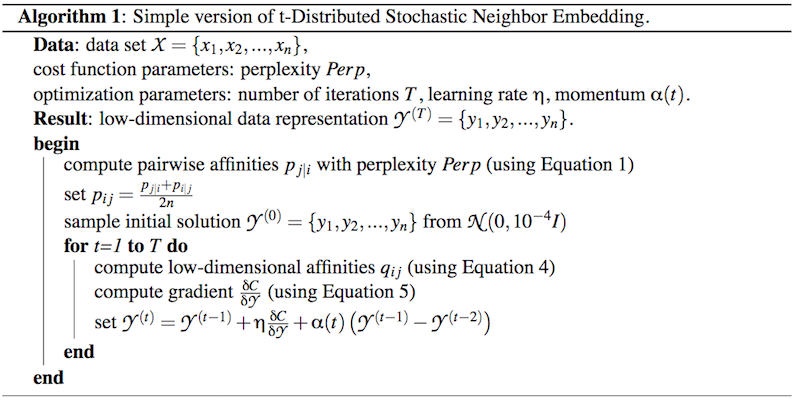

--- 
title: "t-SNE" 
subtitle: "Visualizing high dimensional data in a 2D space" 
author: "Emil K Svensson" 
date: "`r Sys.Date()`" 
output: ioslides_presentation 
#logo: lkpg_logo.png

---

```{r setup, include=FALSE} 
knitr::opts_chunk$set(echo = FALSE)
```

## Disclaimer

Everything not referenced in is this presentation is from the paper Visualizing
High-Dimensional Data Using t-SNE. Written by  L.J.P. van der Maaten and G.E.
Hinton.

Published in the Journal of Machine Learning Research 9(Nov):2579-2605, 2008.

## Overview

- What is high dimensional data? 
- Why is t-SNE necessary? 
- Example
- How does it work? 
- Conclusions

## High Dimensional Data

- Lot of data, many columns 
- Data Mining, searching for underlying structures and finding patterns 
- hard for humans, easy for computers 
- Easiest way to understand is to visualize

## The problems with visualization

- Humans are limited in preciving more than 3 dimensions 
- Visualization techniques for data sets with more dimensions. 
- PCA, Chernoff-faces, Multidimensional Scaling (MDS)

## Example with Chernoff-faces


## What is t-SNE trying to achive?

- Reduce the number of dimensions 
- Conserve the local structure of the data 
- Manifold learning 
- Display similar but ambiguous objects close to each other

## Number example

- MINST data set 
- Contains data from handwritten digits 
- Every digit is a picture of 28 x 28  = 784 columns (pixels) 
- Similar digits close to each other and well separated

[Picture](https://lvdmaaten.github.io/tsne/examples/mnist_tsne.jpg)


## The math behind the magic

- Pairwise distances 
- Perplexity
- Gradient Decent 
- Kullback liebler divergence

## SNE

- t-SNE builds on the work of SNE, Stochastic Neighbohur Embedding
- Uses gaussian kernels for estimating probabilities between points
- Suffers from "The crowding problem"


## The parts

- Converting euclidean distances

- The high dimensional probabilities

$$p_{i|j} = \frac{exp(-||x_i - x_j||^2/2\sigma_i^2)}{\sum_{k\ne i}exp(-||x_i - x_k||^2/2\sigma_i^2)}$$

- The low dimensional probabilities

$$q_{i|j} = \frac{exp(-||y_i - y_j||^2)}{\sum_{k\ne i} exp(-||y_i - y_k||^2)}$$


## Perplexity

- A tunable hyper parameter that is required 
- The relationship between local and global structure of data 
- Can be seen as a smoothing parameter for the data
- Supposed to be stable between Perplexity between 5 - 50
- Has a impact on the final result 

## The Cost Function

- Compare two different distributions - Kullback Leibler Divergence


$$C = KL(P||Q)=\sum_i\sum_jp_{ij}log(\frac{p_{ij}}{q_{ij}})$$


## Gradient Decent

- Optimization algorithm

- Not guaranteed to arrive at the global minimum but a local

- Each iteration trying to get closer to the minimum

- Running gradient decent on the derivative of this expression

$$\frac{\delta C}{\delta y_{ij}} = 4\sum_j(p_{ij}-q_{ij})(y_{i} - y_{j})( 1 +
||y_k - y_l||^2)^{-1}$$

## Code example of gradient decent


Source: Gradient Decent (2017,may 18) In Wikipedia Retried 2017-05-22 from
https://en.wikipedia.org/wiki/Gradient_descent


## Pseudocode




## Conclusions

- Why shouldn't we use t-SNE? 
- The result varies from each run 
- Hard to set hyper-parameters 
- Hard to grasp every component of the algorithm

## Conclusions

- Why should we use t-SNE? 
- It works on real life data sets 
- Can handle variation on low and high level
- Manages to handle ambiguous data (words with different meanings)

## Final example 

[Final example](http://distill.pub/2016/misread-tsne/)
